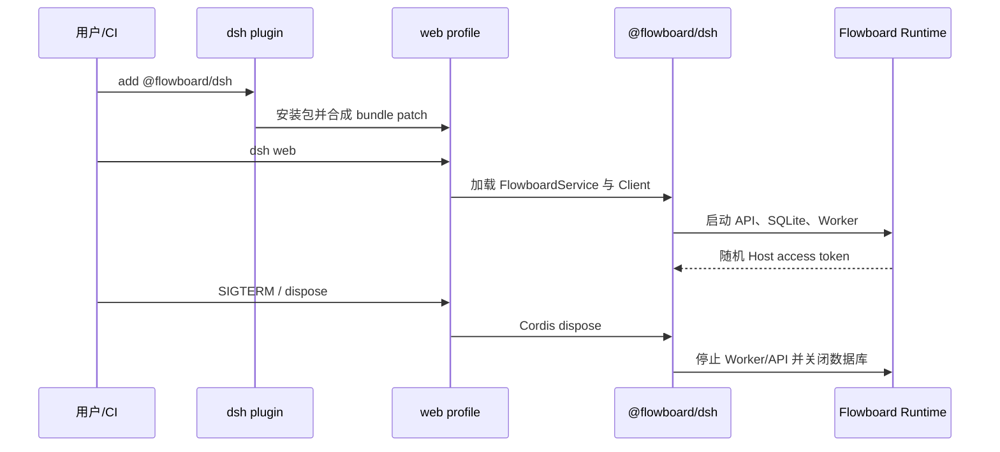
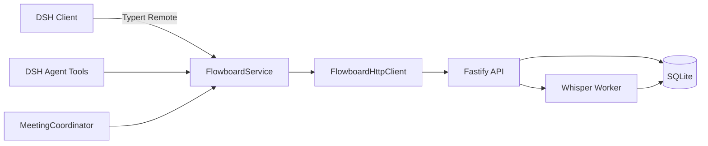

# DSH 原生插件架构与发布规范

> 🆕 本文定义 Flowboard 作为 DSH 开源办公协作与团队管理插件的当前实现与发布基线。代码、CI 和发布流程必须同时满足这些约束。

## 1. 产品与宿主边界 🆕

Flowboard 是运行在 DSH 中的办公协作与团队管理插件，不是 DSH 的替代宿主，也不是让 DSH 反向接入的独立应用。DSH 负责提供团队成员和 Agent 的完整办公入口、Session、profile、插件安装、Host/Client 注入、Web 启动和销毁；Flowboard 在这个生命周期内，以任务为工作骨架，把目标、会议、Agent 执行、进度和资料组织为共享办公上下文。

“不管理，即管理”不是取消任务管理，而是改变任务状态的形成方式：任务仍然是办公的数据骨架，但员工不再脱离 Harness 重复录入。工作开始时形成任务和责任，执行时更新进度和问题，完成时关联资料与结果，团队成员及其 Agent 始终读取同一份权威上下文。🆕

唯一面向用户的安装单元是：

```text
@flowboard/dsh
```

`packages/contracts`、`packages/server`、`packages/dsh-service`、`packages/dsh-client` 和 `packages/typert-protocol-meta` 都是私有源码模块。它们可以独立编译和测试，但不得单独发布、不得出现在最终包的运行时依赖中，也不得要求用户手工安装。

## 2. DSH 生命周期 🆕



`packages/dsh/cordis.patch.yml` 只挂载 `@flowboard/dsh`。`FlowboardService` 默认启动内嵌 Fastify API、SQLite 和 Whisper Worker，并生成 32 字节随机 base64url Token。浏览器仅通过 DSH Typert Remote 调用 Host，不读取 Token，也不直接跨端口访问 API。

默认数据目录为 `$DSH_HOME/flowboard`，未设置 `DSH_HOME` 时为 `~/.dsh/flowboard`。插件升级和卸载只改变 profile 依赖及配置，不自动删除业务数据。

## 3. 单包结构 🆕

```text
@flowboard/dsh
├── package.json          DSH bundle/client manifest
├── cordis.patch.yml      挂载同包 FlowboardService
├── lib/index.js          聚合后的 Host、Server 与 Contracts
├── lib/client.js         单一 Web Client bundle
├── lib/typert.host.js    与公开包名一致的 Remote 元数据
├── vendor/whisper/       Linux x64 CLI、共享库、模型与许可证
├── README.md
└── LICENSE
```

Host 与 Client 必须分别编译。浏览器 bundle 只 externalize React 和 DSH 官方 Client runtime，不允许引入 Node.js 模块。Host 聚合内部服务与业务依赖，只 externalize DSH/Cordis 官方运行时。Typert 的私有编译适配包必须保留官方协议包名，以便生成器发现元数据，但它设置 `private: true`，永不发布。

## 4. 调用与数据流 🆕



浏览器 Remote、Agent 工具和 MeetingCoordinator 最终共享一个 `FlowboardService` 和相同 HTTP 语义。所有写操作经过 Zod 运行时校验、授权、幂等键、乐观锁、事务和审计；任何接入方式都不能建立第二业务状态源或绕过服务端规则。

## 5. 构建与开发链 🆕

```text
内部模块类型检查/构建
        ↓
聚合 Host + 构建单一 Client bundle
        ↓
暂存并校验 Whisper / 重写公开 Typert 包名
        ↓
pnpm pack 生成真实 npm tarball
        ↓
dsh plugin --profile web add <tarball>
        ↓
dsh --profile web --dump-config + dsh web 探活
```

`pnpm dev` 和 CI 使用相同的真实安装边界。禁止通过以下方式模拟插件：

- 把 workspace 包软链接到 DSH profile；
- 使用临时 `--patch` 直接挂载源码或绝对路径；
- 绕过 `dsh plugin add` 直接执行 Flowboard Host；
- 分别安装 `dsh-service` 与 `dsh-client`。

这样可以在开发阶段发现 package exports、peer resolution、Client manifest、Typert 元数据和 bundle patch 的真实问题。

## 6. Whisper 与大文件完整性 🆕

Whisper CLI、共享库和 `ggml-small.bin` 是插件能力的一部分，必须保留在仓库和最终 tarball 中。模型使用 Git LFS；CI checkout 必须启用 LFS。`packages/server/vendor/whisper/SHA256SUMS` 是资产完整性基线，`pnpm run whisper:check` 同时校验源码资产和构建暂存资产。

发布不得包含 LFS pointer。模型小于 400 MB、任一校验和不匹配、许可证缺失或原生库缺失时必须失败。当前 vendor 目标仅为 Linux x64；增加平台支持时应新增独立目录、校验和和对应 CI 验证，不能静默回退到系统二进制。

## 7. 开源与发布流程 🆕

公开仓库应保留 `LICENSE`、`CONTRIBUTING.md`、`SECURITY.md`、`CODE_OF_CONDUCT.md`、`CHANGELOG.md` 和 `THIRD_PARTY_NOTICES.md`。Issue/PR 模板负责收集 DSH、Node、平台、复现步骤和检查结果。

Alpha 阶段采用 `v<base-version>-alpha.<number>` Git tag，并以 GitHub prerelease 交付完整插件 tarball。完整 Whisper 模型使包体超过 npm 客户端可可靠发布的大小，因此不发布 npm dist-tag。发布工作流应：

1. 使用 Git LFS 完整检出源码并以 frozen lockfile 安装。
2. 校验 tag 与 `packages/dsh/package.json` 的 Alpha 版本一致。
3. 执行 `pnpm run release:check`。
4. 仅发布生成的 `@flowboard/dsh` tarball。
5. 将 tarball 与 SHA-256 附加到标记为 prerelease 的 GitHub Release。

内部 workspace 包必须保持 `private: true`。仓库不再提供 `.codex-plugin/plugin.json`，避免形成与 DSH 无关的第二插件身份。

## 8. 验收标准 🆕

- `pnpm run check` 全部通过。
- `pnpm run manifest:check` 确认只有 `@flowboard/dsh` 可公开发布。
- tarball 不含源码 workspace 依赖、LFS pointer、Token、数据库或开发 profile。
- tarball 包含 Host、Client、Typert、README、LICENSE 和完整 Whisper 资产。
- 临时 `DSH_HOME` 中完成 `plugin add -> dump-config -> web boot -> remove`。
- DSH 停止后 API、Worker 和数据库句柄均被释放。
- 卸载后 `$DSH_HOME/flowboard` 数据仍然保留。
