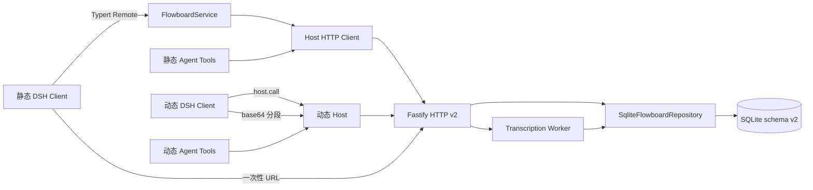
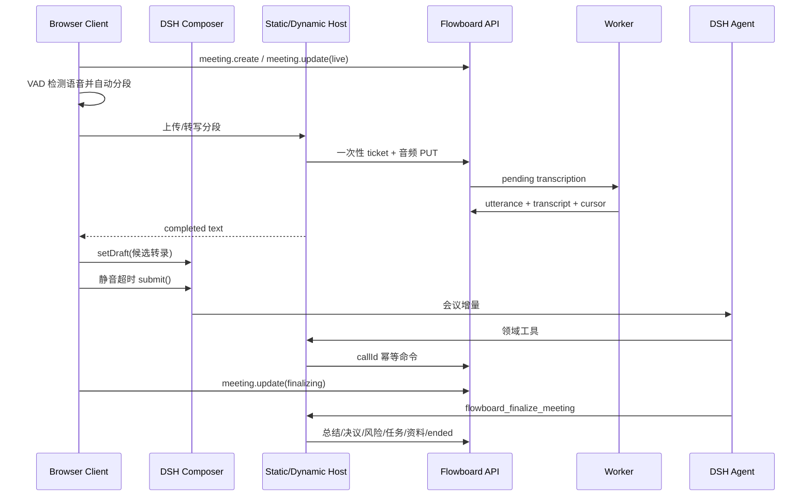

# 系统架构总览

> 🆕 本文以 Flowboard API v2 与当前源码为准。

## 一句话架构

Flowboard 是“一个 v2 共享契约、一个服务端写入口、动态/静态两种 Cordis 交付形态”：两种 Host 使用同一 HTTP 语义，页面和 Agent 工具不会形成第二业务状态源。⚡

## 分层

| 层 | 源码 | 当前职责 |
| --- | --- | --- |
| Contracts | `packages/contracts/src/index.ts` | API v2 DTO、命令、Zod 校验、多对多链接 |
| Client | `packages/dsh-client/src/client` | 左侧工作空间、按 session 会议 owner、VAD、composer 协调 |
| Static Host | `packages/dsh-service/src` | Token、HTTP Client、Remote、callId 幂等工具 |
| Dynamic Host/Client | `dynamic/*.js` | `cordis_define` 纯 JS 函数体；Client 只用 `host.call` |
| HTTP API | `packages/server/src/application.ts` | 路由、认证入口、统一错误、上传接收 |
| Repository | `packages/server/src/repository.ts` | 权限、事务、乐观锁、幂等、审计、版本、游标 |
| Worker | `packages/server/src/worker.ts` | 领取转写任务、写入 utterance、清理临时音频 |

## 数据模型

项目属于团队。会议和资料属于团队安全域，通过 `project_meetings`、`project_library_items`、`meeting_library_items` 与多个项目或会议关联。任务保留单一 `project_id` 作为工作流与编号归属，通过 `task_meetings`、`task_library_items` 关联上下文。⚡

项目看板和任务表不是独立实体副本：`workflow_statuses` 定义项目工作流，`saved_views` 保存 board/table/calendar 的字段与分组配置，任务自定义数据由 `task_field_definitions + tasks.custom_json` 承载。

数据库只接受 schema v2。`openDatabase()` 发现 `schema_migrations` 不是 v2 时会先关闭连接再抛错；当前无生产数据，不提供迁移链。🆕

## 快照与命令

1. 首页与 Agent 空参数 `flowboard_snapshot` 使用 `/v1/summary`，只返回导航与计数。
2. 工作空间 Client 使用 `/v1/snapshot`，可按 `projectId` 或 `meetingId` 缩小范围。
3. 写入统一进入 `/v1/commands`，由 Zod discriminated union 校验。
4. Browser 写入使用 UUID 幂等键；Agent 工具使用 `tool:<callId>:<operation>`。
5. 更新和删除必须携带 `expectedVersion`；冲突显式返回，不做最后写入者覆盖。
6. `change_events` 只提供轻量 cursor，Client 变化后重读权威快照。

`flowboard_snapshot` 的 Agent 执行路径直接调用 Host 拥有的 `FlowboardHttpClient`，不再调用被 `@Remote` 装饰的方法，因此不会进入同一 Typert 调用的取消链。⚡

## AI 会议时序

候选转录在提交后保留于会议 runtime；只有观察到 DSH `InputState` 回到 `phase=plain` 且 `draft=''` 才标记消费完成。会议 runtime 以 `sessionId` 为键，同一会话的 composer Dock 与工作空间视图共享状态。🆕

## 动态与静态交付

动态插件是开发主形态。`dynamic/flowboard.host.js` 和 `dynamic/flowboard.client.js` 是函数体而不是模块，不经过 TypeScript、JSX 或 bundler。动态 Client 禁止 `fetch`、Node 和 import，网络与音频上传均通过 `host.call` 交给 Host。动态与静态 Client 都必须提供项目概览、Jira 看板、多维任务表、项目会议、项目资料、项目成员以及 Markdown 编辑；`dynamic:check` 同时验证隔离约束与工作台能力标记。⚡

静态包用于发布：`pnpm run build` 才生成 Host/Client bundle。`pnpm run check` 验证动态源码、TypeScript、测试和 package 文件清单，但不要求先打静态 bundle。🆕

## 残余边界

- SQLite 适合当前本地或小团队部署；仓库没有 PostgreSQL adapter。
- ASR 质量与吞吐取决于 `FLOWBOARD_TRANSCRIBE_COMMAND`。
- 动态 Host 依赖 DSH shell service，以及 Host 环境中的 `FLOWBOARD_TOKEN`。
