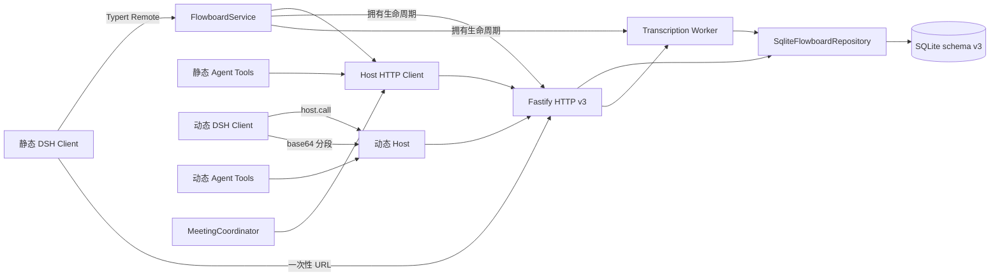
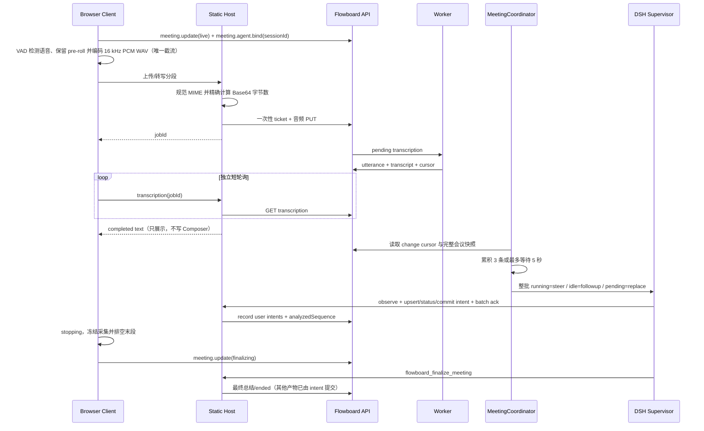

# 系统架构总览

> 本文以 Flowboard API v3 与当前源码为准。

## 一句话架构

Flowboard 是“一个 v3 共享契约、一个服务端写入口、静态为主且动态可降级的两种 Cordis 交付形态”：页面、MeetingCoordinator 和 Agent 工具使用同一 HTTP 语义，不形成第二业务状态源。

## 分层

| 层 | 源码 | 当前职责 |
| --- | --- | --- |
| Contracts | `packages/contracts/src/index.ts` | API v3 DTO、会议意图命令、Zod 校验、多对多链接 |
| Static Client | `packages/dsh-client/src/client` | 完整工作区、Jira/多维任务表、按 session 会议 owner、VAD 与 Supervisor 状态 Dock |
| Static Host | `packages/dsh-service/src` | HTTP Client、Remote、MeetingCoordinator、Agent Tools 及内嵌 API/Worker 生命周期 |
| Dynamic Host/Client | `dynamic/*.js` | `cordis_define` 纯 JS 函数体；Client 只用 `host.call` |
| HTTP API | `packages/server/src/application.ts` | 路由、认证入口、统一错误、上传接收 |
| Repository | `packages/server/src/repository.ts` | 权限、事务、乐观锁、幂等、审计、版本、游标 |
| Worker | `packages/server/src/worker.ts` | 使用随包 Whisper 领取转写任务、写入 utterance、清理临时音频 |

## 数据模型

项目属于团队。会议和资料属于团队安全域，通过 `project_meetings`、`project_library_items`、`meeting_library_items` 与多个项目或会议关联。任务保留单一 `project_id` 作为工作流与编号归属，通过 `task_meetings`、`task_library_items` 关联上下文。⚡

项目看板和任务表不是独立实体副本：`workflow_statuses` 定义项目工作流，`saved_views` 保存 board/table/calendar 的字段与分组配置，任务自定义数据由 `task_field_definitions + tasks.custom_json` 承载。

`meeting_agent_bindings` 持久化会议与 DSH Session 的绑定及投递/分析水位；`meeting_intents` 保存稳定意图键、证据序号、修订、状态、Subagent 和最终实体引用。数据库只接受 schema v3；当前无生产数据，不提供迁移链。

## 快照与命令

1. 首页与 Agent 空参数 `flowboard_snapshot` 使用 `/v1/summary`，只返回导航与计数。
2. 工作空间 Client 使用 `/v1/snapshot`，可按 `projectId` 或 `meetingId` 缩小范围。
3. 写入统一进入 `/v1/commands`，由 Zod discriminated union 校验。
4. Browser 写入使用 UUID 幂等键；Agent 工具使用 `tool:<callId>:<operation>`。
5. 更新和删除必须携带 `expectedVersion`；冲突显式返回，不做最后写入者覆盖。
6. `change_events` 只提供轻量 cursor，Client 变化后重读权威快照。

`flowboard_snapshot` 的 Agent 执行路径直接调用 Host 拥有的 `FlowboardHttpClient`，不再调用被 `@Remote` 装饰的方法，因此不会进入同一 Typert 调用的取消链。⚡

## AI 会议时序

转录只进入权威会议稿。MeetingCoordinator 在每个 Step 注入完整转录与意图账本，并合并未消费通知；连续积累 3 条或首条等待 5 秒后才整批投递，`finalizing` 会立即冲刷剩余批次。Agent 忙碌时使用 steering，空闲时启动 follow-up。`flowboard_ack_meeting` 必须携带本批分析摘要和用户意图，先用幂等 `meeting.intent.record` 补齐可见意图，再一次推进分析水位；普通 AI 回复由 DSH 对话区展示，会议面板只持久化待追踪提问和业务操作。页面以“待投递 / AI 正在分析 / AI 已追平”展示 `latest/delivered/analyzed` 三段水位；详情范围快照会整体替换该会议的绑定和意图，避免 cursor 先行导致 UI 漏更新。`meeting.finalize` 会拒绝仍有转写任务、遗漏水位或未决意图的请求。

结束会议由 Client 侧 `stopping` 状态串行化：状态置位后录音 Hook 立即 release，详情页和输入 Dock 的结束按钮同时禁用，最后片段与在途上传排空后才提交 `meeting.update(finalizing)`。末段转写失败会保留显式错误，但不会阻止会议离开 `live`，避免录音恢复或重复结束竞态。

静态与动态 Client 都通过 Web Audio 收集单声道 PCM，包含 350ms pre-roll、800ms 静音切段与 15 秒连续语音上限，并通过带低通滤波的 sinc 重采样编码为 16 kHz 16-bit WAV。这个 VAD 分段是唯一截流边界；Host 上传成功后只返回 `jobId`，Whisper 每完成一段就立即写入 utterance，不再叠加固定窗口或延迟聚合。Worker 用两个有界并发槽处理短片段，结果仍按任务领取顺序写回。Whisper 不接收历史转录 prompt，防止识别错误在长会议中自我强化；完整语义上下文只由 Supervisor 消费。Whisper 不需要 ffmpeg 解码 MediaRecorder 的 WebM/Opus，上传票据的 `expected_size/content_type` 也与实际 PUT 严格一致。⚡

## 静态与动态交付 ⚡

静态插件是开发、验证和发布主形态。`@flowboard/dsh-client` 使用 React 18、Ant Design 5、TanStack Table、Dnd Kit 与 CSS Modules：Ant Design 负责 token、菜单、表格、弹窗和结构化控件，TanStack Table 负责任务行模型，Dnd Kit 负责 Jira 拖放，CSS Modules 只负责工作台布局和领域样式。左栏承载完整菜单、人物切换和项目分组，项目页签位于内容区顶部。🆕

`pnpm dev` 依次校验动态降级源码、类型检查、构建静态 Host/Client，幂等维护 profile `node_modules` 中指向当前 `dsh-service/dsh-client` workspace 的两个软链接，再以裸包名临时 patch 启动 `dsh web`。裸包名很关键：ClientModuleRegistry 只会为可解析 package root 的 `dsh.client` manifest 发布浏览器 bundle，直接加载 `lib/index.js` 绝对路径只能启动 Host 半边。静态 `FlowboardService` 默认内嵌 API、SQLite 与 Worker，DSH dispose 时统一关闭；脚本不执行插件安装/重装，也不改 profile manifest。默认 Web/API 地址分别为 `127.0.0.1:3080` 与 `127.0.0.1:8787`。🆕

`@flowboard/server` 的发布清单包含 Linux x64 `whisper-cli`、所需共享库、许可证和多语言 `ggml-small` 模型。默认固定以中文识别，每段只使用当前 WAV，不回灌之前的模型输出。默认会议转写不依赖系统 Whisper、ffmpeg、模型目录或环境变量；`FLOWBOARD_TRANSCRIBE_LANGUAGE` 可覆盖默认语言，`FLOWBOARD_TRANSCRIBE_COMMAND` 只作为独立 Worker 的高级覆盖。浏览器输出 WAV 使音频链无需另带编解码器。🆕

动态插件是实验与应急入口。`dynamic/flowboard.host.js` 和 `dynamic/flowboard.client.js` 是函数体而不是模块，不经过 TypeScript、JSX 或 bundler；Client 禁止 `fetch`、Node 和 import。音频上传只返回 `jobId`，Client 通过 `transcription` Host handler 独立轮询，避免长时间占用一次 `host.call`；会议打开期间每秒合并一次详情水位、意图、提问与操作。动态版实现相同的批次确认和 `stopping` 语义，但不要求与静态版逐像素一致。⚡

之所以调整交付优先级，是因为完整 Jira、多维表格和一致设计系统需要类型检查、组件复用与稳定构建；动态函数体继续作为无需打包的诊断和应急通道。

## 残余边界

- SQLite 适合当前本地或小团队部署；仓库没有 PostgreSQL adapter。
- 默认 ASR 使用随包 `ggml-small` 和中文语言提示，当前内置原生运行时只支持 Linux x64；其他平台发布前需要增加对应 vendor 变体。
- 动态 Host 依赖 DSH shell service，以及 Host 环境中的 `FLOWBOARD_TOKEN`。
