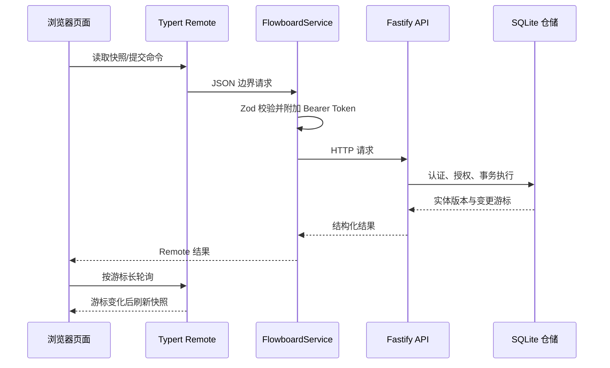

# Flowboard 完整重构方案

## 背景

旧原型由浏览器直接访问 HTTP、依赖单一 JSON 状态和固定频率全量轮询，身份、权限、错误和写入规则分散。此次重构把 Flowboard 建成由 DSH 托管的单包插件，并统一页面、Agent 与服务端的数据路径。⚡

## 目标

- 项目、任务、会议、资料、日历和成员使用一致的页面结构与操作逻辑。
- 浏览器不持有 API Token，页面与 Agent 共用 Host Service。
- 写操作具备授权、校验、幂等、乐观锁、事务、审计和版本记录。
- DSH Client 使用 Ant Design 5 主题与组件、TanStack Table、Dnd Kit 和单 bundle 装载方式。⚡
- SQLite 可直接运行；为未来数据库实现保留仓储边界，但不虚构 PostgreSQL 能力。

## 模块映射

| 模块 | 代码位置 | 当前职责 |
| --- | --- | --- |
| DSH 公开插件 | `packages/dsh` | 唯一公开 manifest、Cordis patch、聚合 Host/Client/Typert 和 Whisper 资产 🆕 |
| 契约 | `packages/contracts/src/index.ts` | DTO、命令联合类型、Zod schema、上传限制 |
| 数据库 | `packages/server/src/database.ts` | SQLite schema、迁移、默认租户与基础数据 |
| 仓储 | `packages/server/src/repository.ts` | 授权、查询、事务命令、幂等、版本和审计 |
| HTTP | `packages/server/src/application.ts` | Fastify 路由、统一错误、长轮询、上传 |
| Worker | `packages/server/src/worker.ts` | 使用随包 Whisper 领取转写任务、写回记录、清理临时音频 |
| Host | `packages/dsh-service/src/index.ts` | `FlowboardService`、Typert Remote 与内嵌 API/Worker 生命周期 |
| Agent 工具 | `packages/dsh-service/src/tools.ts` | 快照、通用命令、任务创建和任务更新 |
| Client 控制器 | `packages/dsh-client/src/client/controller.ts` | 快照、项目选择、命令刷新、退避长轮询 |
| Client 页面 | `packages/dsh-client/src/client/domain/` | 项目、任务、会议、资料、日程、人员、团队、Markdown 与统一框架控件 ⚡ |

## 核心流程 🆕

Agent 调用从 `FlowboardService` 开始，之后与浏览器使用完全相同的 HTTP、权限和仓储路径。

## 写入不变量 ⚡

每个命令在一个 `BEGIN IMMEDIATE` 事务中执行：

1. Bearer Token 映射为当前 actor 和 tenant。
2. 根据团队或项目角色检查读写权限。
3. Zod 校验命令类型和 payload。
4. 相同幂等键和相同请求直接重放；相同键对应不同请求返回冲突。
5. 更新与删除必须提供当前 `expectedVersion`。
6. 写当前实体，并追加 `entity_versions`、`audit_events` 和 `change_events`。
7. 保存幂等结果后提交事务。

项目选择只存在于当前浏览器控制器中，不写入共享数据库。

## 页面设计 ⚡

- 左侧承载首页、我的任务、个人看板、个人日程、会议、资料、人员、团队和项目分组；人物视角固定显示但不改变登录 actor。⚡
- 进入项目后，内容区顶部固定为项目名称与同步状态，第二行为概览、Jira 面板、任务列表、会议、资料和人员页签。⚡
- 每页使用相同的标题、数量、搜索和主操作布局。
- 创建与编辑使用 Ant Design `Modal/Input/Select/DatePicker`，删除使用统一确认对话框；人员、团队和项目成员使用同一套 `Table/Avatar/Tag/Progress`。🆕
- Jira 看板通过 Dnd Kit 拖放，多维任务表通过 TanStack Table 行模型与结构化单元格编辑实现。🆕
- 看板列是工作容器，任务是重复卡片；其他页面以表格或列表为主，不嵌套装饰卡片。
- Flowboard 通过 `ConfigProvider` 拥有独立的颜色、尺寸、圆角和组件 token；DSH token 只作为宿主兼容回退。
- 移动端页签和看板横向滚动，表格只隐藏次要列，不挤压主要信息。

此次修订把旧的“左栏只有项目、动态默认”描述改为当前实现，因为工作区已经形成完整菜单和人物视角，正式视觉与复杂交互也已经由静态框架承担。

## Typert 编译适配

Typert rc.6 在独立 pnpm workspace 中无法稳定跨本地 contracts 包识别 `Remote` 元标记，因此 Remote 方法使用受控 JSON 字符串作为生成边界，Host 内部立即用共享 Zod schema 解析。

`packages/typert-protocol-meta` 的本地包名为 `@deepseek-ai/dsh-typert-protocol`，只在编译分析时提供元数据，并在运行时转发 npm alias 的官方协议实现。它不是业务协议 fork，也不拥有业务 DTO。

## 验收清单

- [x] 契约 schema 测试
- [x] 鉴权、幂等、乐观锁、租户隔离、审计与版本测试
- [x] HTTP 命令、变更游标和一次性上传测试
- [x] Worker 成功、失败和音频清理测试
- [x] Host HTTP Client Bearer 与结构化错误测试
- [x] Client 快照、命令刷新和断线退避测试
- [x] Host/Client 类型检查和 bundle 构建
- [x] 单一 DSH 插件 manifest 校验
- [x] 零参数 `pnpm dev` 打包、真实安装并由 DSH profile 启动
- [x] PCM WAV 录音和随包 Whisper 真实音频转写
- [ ] PostgreSQL adapter（当前范围不包含）
