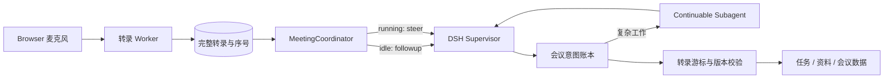

# Flowboard 会议 Supervisor 重构

## 目标

会议转录不再逐段写入 DSH Composer，也不再把每次 VAD 切段等同于一次 AI 任务。每场 live 会议绑定一个长期存在的 DSH Session，由会议 Supervisor 持续理解完整转录、维护意图、派发和管理后台 Subagent，并在最新转录校验通过后写入任务、资料或会议结论。

## 当前问题

- Client 在转写完成后调用 `setDraft()` 和 `submit()`，Agent 忙碌时补充内容进入后续 Turn。
- ASR 切段、AI 分析和业务提交共用一个节奏，半句话可能触发真实写入。
- `meeting_ai_actions` 只能记录已执行结果，无法表达待确认、纠正、失效和重试。
- Agent Tool 使用 call ID 幂等，但不能识别同一会议意图的修订和重复执行。
- 调度由浏览器页面持有，页面刷新或切换后不能保证会议 AI 连续工作。

## 目标架构



### DSH 分工

- `Agent.followup()`：Supervisor 空闲时启动一个分析 Turn。
- `Agent.steer()`：Supervisor 运行时把新转录送到下一个 Step。
- `Agent.inbox.replace()`：合并尚未消费的会议通知，避免队列堆积。
- `systemPrompt.context()`：每个 Step 提供当前会议、转录水位、意图和执行状态。
- `agent/turn-stopping`：Turn 关闭前检查是否还有未分析转录。
- continuable `subagent`、`list_agents`、`send_message`、`interrupt_agent`：执行和管理复杂后台任务。

Supervisor 是当前可见 DSH Conversation 的 Agent。Subagent 只负责有界的研究、整理和结构化输出，最终业务写入仍由 Supervisor 使用 Flowboard Tool 完成。

## 数据状态

- `meeting_agent_bindings`：`meeting_id`、`session_id`、绑定状态和投递/分析水位；不另建重复的 AI 水位表。
- `meeting_intents`：意图类型、结构化载荷、证据序号、修订、状态、关联实体和 Subagent。
- `meeting_ai_actions`：保留为最终执行审计，不再承担待处理状态。

意图状态：

```text
detected -> clarifying -> approved -> executing -> applied
        \-> superseded
        \-> rejected
        \-> failed
```

## 核心流程

1. 开始会议时将 `meeting_id` 与当前 `session_id` 绑定。
2. ASR 完成后原子追加带序号的 utterance；Browser 只展示结果，不提交 Composer。
3. Coordinator 合并短时间内的新增序号。Supervisor 运行时 `steer`，空闲时 `followup`。
4. Supervisor 读取会议状态并通过 `flowboard_upsert_meeting_intent` 新建或修订意图。
5. 复杂意图可关联 continuable Subagent；Supervisor 可以查询、补充或中断它。
6. `flowboard_commit_meeting_intent` 使用 `basis_sequence + intent_revision` 校验最新转录和版本；过时请求返回结构化冲突，不产生业务写入。
7. 会议进入 `finalizing` 后等待最后 ASR、未决意图和必要 Subagent 收敛，再生成总结并结束。

`meeting.finalize` 是最终一致性闸门：仍有 `pending/processing` 转写、`analyzed_sequence` 落后或非终态意图时必须返回冲突，不能提前结束会议。

浏览器 VAD 是音频链唯一的截流边界。静态 Client 把已经分好的 WAV 交给 DSH Host，由 Host 申请一次性票据并完成 PUT；Host 拿到 `jobId` 后立即返回，Browser 独立轮询。Whisper 每完成一段，Worker 就立即追加 utterance、推进 change cursor 并唤醒 Coordinator，不增加固定窗口、二次静音等待或会后批量写稿。随包 `ggml-small` 默认固定中文识别，并把同一会议最近的已确认 utterance 作为有界 prompt；上下文只影响单段识别质量，不改变提交时机和权威文字稿的逐段结构。

## 交互调整

- Composer 仅用于人工输入，不再承载自动转录候选稿。
- 会议 Dock 显示录音、转写、待分析序号、Supervisor 状态、待确认意图和后台 Agent 数量。
- `record` 只维护转录和总结；`suggest` 等待确认；`execute` 只自动提交低风险且校验通过的意图。

## 验收

- Supervisor 运行期间的新发言在下一个 Step 可见，不等待整个 Turn。
- “给张三，不对，给李四”只形成一个最终意图和一个任务。
- 新转录在 Tool 提交前到达时，旧提交被游标校验拒绝。
- 多段转录只形成一个可替换通知，不产生消息队列堆积。
- 页面刷新后可从绑定和转录水位恢复。
- Supervisor 可以创建、列出、补充和中断 continuable Subagent。
- `pnpm run check`、静态构建和动态插件校验通过。
