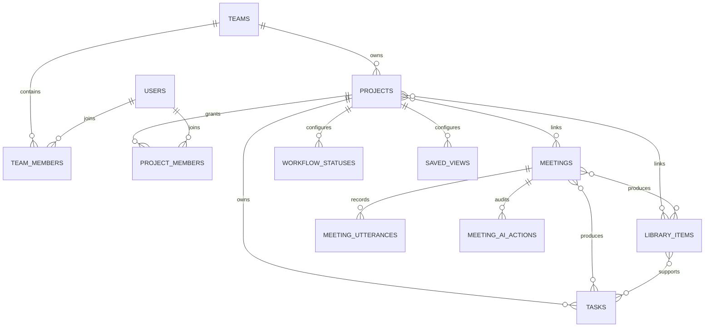
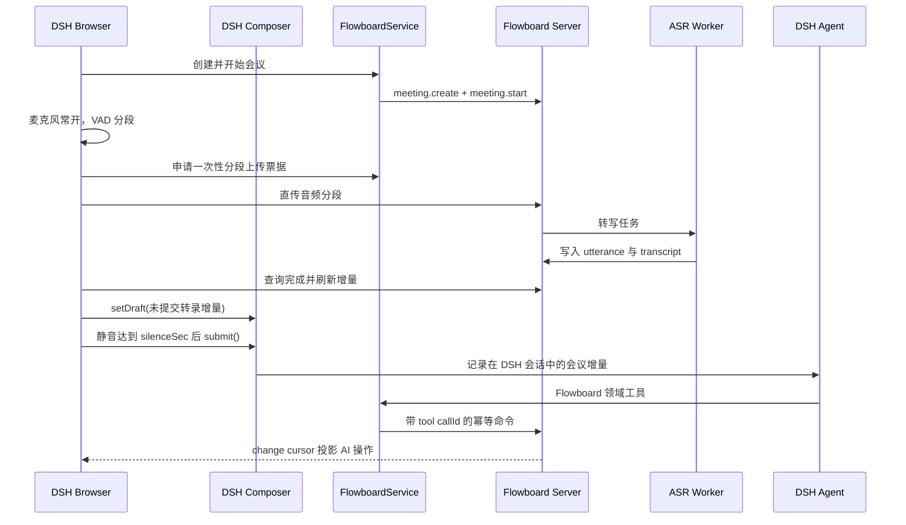

# Flowboard 工作空间与 AI 会议完整重构

## 背景

Flowboard 0.1.x 已具备项目、任务、会议、资料、日历、成员、统一 Host Service、SQLite 仓储和 DSH 页面，但业务关系仍以单项目归属为中心，页面使用顶部项目选择与横向页签，录音仅在手动停止后整段转写。该结构不能承载跨项目会议与资料、项目独立工作流、个人聚合视图和 AI 持续参会。

本次重构将 API 升级为 v2，在一次版本内切换数据库、契约、Host、Client 和 Agent 工具，不保留旧协议双写。当前没有需要保留的业务数据，因此数据库直接使用全新 v2 schema；检测到旧 schema 时明确拒绝启动并提示删除开发数据库，不实现迁移或兼容读取。

## 产品结构

左侧工作空间导航固定为：首页、项目树、会议、资料、我的工作和组织。每个项目节点展开为概览、看板、任务表、会议、资料和成员。首页以开始会议、今日安排、我的任务、活动项目和 AI 操作为核心。

项目、会议和资料通过显式关联表形成多对多关系。任务保留一个主项目以确定权限、工作流和统计，同时可关联多个会议与资料。个人任务、个人日历和个人看板是跨项目查询，不复制业务数据。

## 数据模型

关联只表达业务归类，不扩大授权。团队是会议和资料的安全域；项目成员只能读取其团队允许且至少关联一个可访问项目的资源，团队 owner/admin 可管理团队域资源。跨团队关联在 v2 中禁止。

看板是任务查询的保存视图。核心任务字段使用物理列；自定义字段保存在 `custom_json`，定义由 `task_field_definitions` 管理。每个项目拥有独立 `workflow_statuses`，`saved_views` 保存 board/table/calendar 的过滤、排序、分组和字段配置。

## AI 会议流程

会议录音 owner 按 DSH `sessionId` 隔离，同一浏览器只允许一个麦克风 owner。interim 文本只显示，final utterance 持久化后进入 DSH composer。提交后不由插件立即清空本地缓冲，而以 DSH input draft 状态和服务端 utterance cursor 确认消费。失败时保留候选稿。

会议结束顺序固定为：停止采集、排空最后分段、提交剩余转录、进入 `finalizing`、AI 调用 `meeting.finalize` 写总结/决议/风险/行动项/资料与关联、最后进入 `ended`。删除、成员权限和团队结构操作不允许会议 AI 自动执行。

## 架构边界

- Contracts 定义 v2 DTO、命令、页面查询和运行时校验。
- Client 只负责工作空间导航、展示、麦克风/VAD 和 DSH composer 协调，不持有 API Token。
- `FlowboardService` 是浏览器 Remote 与 Agent 工具的共同入口。
- HTTP API 只解析请求和统一错误；Repository 负责授权、事务、幂等、乐观锁、版本、审计和变更游标。
- Worker 只负责音频转写和临时文件清理；成功写入使用 Repository 的同一会议写入规则。
- SQLite 是当前本地/小团队事实源；仓储接口继续允许后续 PostgreSQL adapter，但本次不虚构未实现能力。

## DSH 动态与静态交付

动态 Cordis Package 是日常开发和快速更新的主形态。仓库生成 `dynamic/flowboard.host.js` 与 `dynamic/flowboard.client.js`，文件内容分别是可直接传给 `cordis_define.code.host` 和 `cordis_define.code.client` 的纯 JavaScript 函数体。动态源码不得包含 TypeScript、JSX、静态 import 或浏览器 `fetch`；Host 通过 `harness.handle` 暴露 JSON 方法并通过 `harness.defineTool/registerTool` 注册 Agent 工具，Client 通过 `host.call` 调 Host，并通过 DSH Slot 注册页面与会议 Dock。

静态 `@flowboard/dsh-service` 与 `@flowboard/dsh-client` 保留为部署和发布形态。动态与静态实现共享同一 Flowboard HTTP v2 契约、工具名称、幂等规则、导航信息架构和页面行为；静态打包不再是本地开发的前置条件。仓库提供动态源码语法检查和生成命令，必要时才运行静态 bundle 打包。

## 任务与验收

- [ ] 全新 v2 schema，旧 schema 明确拒绝启动
- [ ] 左侧导航与所有项目、会议、资料、个人、团队页面
- [ ] 项目独立看板和任务表视图
- [ ] 跨项目会议、资料及会议产物关联
- [ ] VAD 连续分段转写、DSH 候选稿和静音自动提交
- [ ] AI 会议工具使用 DSH callId 作为稳定幂等来源
- [ ] 动态 Host/Client 函数体可直接通过 `cordis_define` 定义与运行
- [ ] `flowboard_snapshot` 不经过 Typert Remote 自调用且不会无故中断
- [ ] 会议结束结构化整理与可审计操作记录
- [ ] Host/Client 分别编译，浏览器 bundle 不包含 Node 能力
- [ ] `pnpm run check` 与插件 manifest 校验通过
