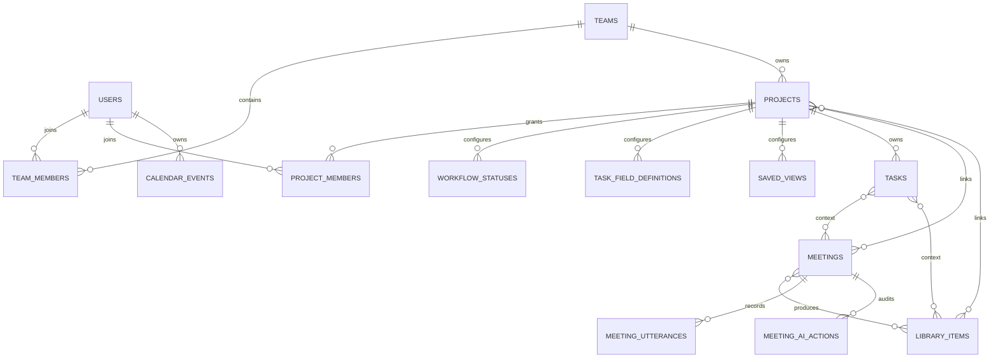
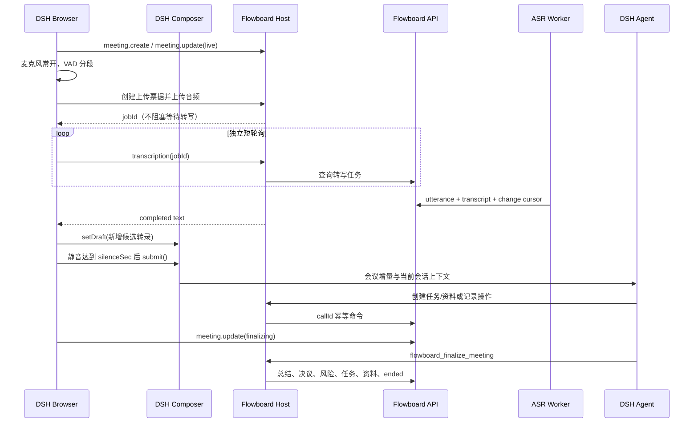

# Flowboard Jira 工作空间与 AI 会议整体重构

> 🆕 本文是本轮整体重构的产品、权限、交互和工程验收基线。当前没有需要迁移的业务数据，数据库继续直接使用 v2 schema，不增加迁移或旧协议兼容。

## 一、产品定位

Flowboard 不是一组孤立的管理页面，而是一个以项目和任务为事实核心、以会议为高频输入入口、由 AI 持续维护工作内容的团队协作系统。

- Jira 工作区负责项目、工作流、任务、人员、权限和进度管理。
- 多维任务表负责高密度录入、原位编辑、筛选、排序和自定义字段。
- AI 会议负责实时转录、上下文理解、行动项提取、资料沉淀和会后归档。
- Markdown 是任务详情、会议转录/总结和资料正文的统一可编辑内容格式。
- AI 是受权限、风险等级、确认机制和审计约束的项目助理，不是旁路聊天机器人。

## 二、信息架构

左侧是完整的工作区菜单，不是单独的项目列表。项目是菜单中的可滚动分组；进入项目后，项目内部再通过横向 Tab 展开领域页面。

```text
Flowboard
├── 当前工作视角（人物选择）
├── 首页
├── 我的任务
├── 个人看板
├── 个人日程
├── 会议列表
├── 资料列表
├── 人员管理
├── 团队管理
└── 项目
    ├── 项目 A
    ├── 项目 B
    └── 项目 C
```

进入项目后：

```text
项目名称 / 项目 Key / 同步状态
概览 | Jira 面板 | 任务列表 | 会议 | 资料 | 人员
```

项目、会议、资料和人员是跨域关联关系：一个人可以参加多个项目，一个会议和一份资料可以关联多个项目；任务保留一个主项目以确定编号、工作流和权限，同时关联多个会议和资料。

## 三、账号、人物与权限

### 3.1 登录身份与人物视角分离

- `actor` 是服务端认证后的真实账号，决定可读取和可修改的数据。
- `person` 是组织中的人员档案，用于任务负责人、参与人、日程和负载统计。
- `selectedPersonId` 只是客户端工作视角，用于聚合“我的任务、个人看板、个人日程”。
- 人物视角不能改变服务端 actor，不能扩大项目、团队或资源权限。
- 普通成员默认使用自己绑定的人物；管理员可查看授权范围内其他成员的工作视角，界面必须持续显示当前人物。

### 3.2 分层 RBAC

| 范围 | 角色 | 能力 |
| --- | --- | --- |
| 团队 | `owner` | 团队、成员、项目和权限完整管理 |
| 团队 | `admin` | 团队内容和成员管理，不可删除最后 owner |
| 团队 | `member` | 使用被授权项目和团队内容 |
| 团队 | `viewer` | 只读访问 |
| 项目 | `owner` | 项目配置、成员、工作流和内容管理 |
| 项目 | `admin` | 项目成员、工作流和内容管理 |
| 项目 | `member` | 创建和编辑项目内容 |
| 项目 | `viewer` | 只读项目内容 |

权限不变量：

1. 前端禁用或隐藏操作只是体验层，服务端必须再次校验。
2. 所有写操作经过运行时校验、授权、幂等、乐观锁、事务和审计。
3. 负责人和人员类型字段只能选择当前项目成员。
4. 会议与资料的跨项目关联不能跨团队，也不能授予新的访问权。
5. AI 沿用发起用户权限，高风险操作不能因为 AI 参与而绕过确认。

## 四、领域模型



当前核心关系表：

- `team_members`：团队成员与团队角色。
- `project_members`：项目成员与项目角色。
- `project_meetings`：项目与会议多对多。
- `project_library_items`：项目与资料多对多。
- `task_meetings`：任务与会议多对多。
- `task_library_items`：任务与资料多对多。
- `meeting_library_items`：会议产出或引用资料。

## 五、Jira 与任务管理

### 5.1 任务字段

任务基础字段包括：

- 标题、摘要、Markdown 详情；
- 项目、项目内连续编号；
- 工作流状态、优先级、进度；
- 负责人、分类；
- 截止时间；
- 关联会议、关联资料；
- 自定义字段、版本、创建和更新时间。

自定义字段支持：`text / number / boolean / date / select / multi_select / person`。字段类型、必填、选项和位置可在表头管理；字段改为不兼容类型时清理旧值，避免错误数据继续参与查询。

### 5.2 Jira 面板

- 默认按项目工作流状态分列。
- 支持按状态、负责人、优先级、分类和项目分组。
- 使用拖放修改任务状态、负责人、优先级或分类。
- 列头显示颜色、数量和工作流编辑入口。
- 卡片显示编号、标题、摘要、分类、负责人、进度、优先级和截止时间。
- 点击标题打开 Markdown 任务详情；编辑和删除使用统一对话框。
- 个人看板按当前人物跨项目汇总，默认按项目分列。

### 5.3 多维任务表

- 单元格原位编辑，标题、状态、负责人、优先级、分类、进度、截止时间无需打开表单。
- 表头显示字段类型，可创建、编辑和删除自定义字段。
- 单选、多选、人员和日期使用对应的结构化编辑器，不退化为普通文本框。
- 支持搜索、分组、横向滚动、固定表头和清晰焦点态。
- 个人任务表按当前人物跨项目汇总，额外显示项目列。
- 任务创建/完整编辑表单继续处理 Markdown、关联会议、关联资料和全部自定义字段。

### 5.4 项目与团队管理

- 项目列表负责创建、编辑、删除和进入项目。
- 项目人员页负责加入、移出和修改项目角色，并显示任务负载与完成情况。
- 人员管理负责组织人员档案、所属团队数、项目数和任务负载。
- 团队管理负责团队创建、编辑、删除以及成员角色管理。
- 删除最后一个 owner、删除仍有关联资源的团队等危险操作由服务端拒绝，客户端显示结构化错误。

## 六、AI 会议系统

### 6.1 生命周期

```text
scheduled -> live -> finalizing -> ended
          \-> cancelled
```



动态 Host 的音频上传调用只返回 `jobId`，转写状态通过独立短调用轮询，避免将上传、排队和 ASR 完成塞进一次 `host.call` 导致 `transcription timed out`。静态 Client 同样保持上传与轮询分离。

### 6.2 AI 参与模式

| 模式 | 行为 |
| --- | --- |
| `record` | 只转录、总结和归档，不修改业务实体 |
| `suggest` | 生成任务、资料和变更建议，由用户确认后执行 |
| `execute` | 自动执行低风险白名单操作，高风险操作仍需确认 |

AI 可以：

- 识别行动项并创建任务；
- 补充负责人、优先级、截止时间和关联会议；
- 记录决议、风险与未决问题；
- 创建或更新 Markdown 资料；
- 提醒缺少负责人、截止时间或议题偏离；
- 在会议结束时生成结构化总结和操作审计。

AI 不可自动执行：删除实体、修改成员权限、修改团队结构、跨团队关联和其他不可逆操作。

### 6.3 转录可靠性

- 浏览器 MIME 统一规范为小写基础类型，例如 `audio/webm`。
- Base64 上传大小扣除末尾填充，票据字节数与实际 PUT 一致。
- `clientSegmentId` 保证重复上传幂等。
- 每段转录独立进入任务队列，慢 ASR 不阻塞 Host RPC。
- 候选稿在提交失败时保留；只有 composer 回到 `plain + draft=''` 才确认消费。
- 会议停止后先排空最后分段，再进入 `finalizing`。

## 七、统一视觉与交互系统

目标是安静、专业、高密度的 Jira/Linear/多维表格工作台，不使用营销页构图和装饰性卡片堆叠。

- React 18 + TypeScript 承载正式静态插件。
- Flowboard 拥有独立视觉皮肤，不要求复刻 DSH；DSH UI Primitives 只用于兼容宿主 Slot、Modal 和基础按钮行为，Flowboard 自有 token 决定导航、数据表、选择器、标签和看板外观。
- 领域组件统一封装选择器、弹层、菜单、状态标签、人员头像和空状态。
- 看板拖放使用稳定的拖放交互边界；任务表使用结构化行列模型。
- CSS Modules 定义统一的尺寸、边框、颜色、焦点、hover、disabled 和响应式规则；色彩使用中性石墨灰、白色数据面、靛蓝主操作，并为成功、警告、危险和分类建立独立语义色，不使用渐变或单色铺满页面。
- 原生控件只作为语义与降级基础，不能以浏览器默认样式直接暴露在工作区。

统一规范：

- 侧栏 260px，导航行 38-40px，项目作为次级分组。
- 当前人物视角始终可见，人物头像、姓名和“我”标识一致。
- 项目标题与横向 Tab 固定在内容区顶部。
- 表格表头、行高、单元格编辑态、标签色板和焦点态全局一致。
- 看板列宽稳定，动态内容不能引发布局跳动。
- 人员、会议和资料使用高密度表格/列表，不把页面区块包装成悬浮卡片。
- 移动端菜单和项目列表横向滚动，主要操作和文本不重叠。

## 八、静态与动态插件策略

静态插件是默认开发、验证和发布方式：

- 使用完整 React/TypeScript/CSS Modules 工程能力；
- 支持类型检查、组件复用、测试、增量构建和正式打包；
- 一键开发脚本负责校验、构建、维护本地 workspace 包软链接，并通过裸包名临时 patch 启动 DSH；静态 Host 内嵌 API/Worker 生命周期；
- `pnpm dev` 不接受必需参数，不安装或重装插件，也不修改 DSH profile manifest；裸包名让 DSH 能发现并发布 `dsh.client` 浏览器 bundle；
- Whisper CLI、共享库和多语言 base 模型进入 server 发布清单，浏览器直接生成 WAV，不依赖系统 Whisper 或 ffmpeg；
- 开发和重构不执行插件重装，只有正式发布才生成 tgz。

动态插件降级为实验与应急入口：

- 保留 `dynamic/flowboard.host.js` 与 `dynamic/flowboard.client.js`；
- 只通过 `host.call` 访问 Host，浏览器不得直接 `fetch`；
- 保持关键导航、任务、会议、资料和人员能力，但不再要求与静态版逐像素同步；
- `pnpm run dynamic:check` 继续验证函数体隔离和关键能力。

## 九、架构边界

| 模块 | 代码位置 | 职责 |
| --- | --- | --- |
| Contracts | `packages/contracts/src/index.ts` | v2 DTO、命令联合类型、Zod 校验与上传限制 |
| Static Client | `packages/dsh-client/src/client` | 导航、人物视角、Jira/表格、会议录音、composer 协调 |
| Static Host | `packages/dsh-service/src` | HTTP Client、Typert Remote、Agent 工具及内嵌 API/Worker 生命周期 |
| Dynamic Plugin | `dynamic/*.js` | 实验性纯 JavaScript Host/Client |
| HTTP API | `packages/server/src/application.ts` | 认证入口、路由、统一错误、上传接收 |
| Repository | `packages/server/src/repository.ts` | 授权、事务、幂等、乐观锁、审计、版本和游标 |
| Worker | `packages/server/src/worker.ts` | 领取转写任务、调用 ASR、写入 utterance、清理音频 |
| Database | `packages/server/src/database.ts` | SQLite v2 schema 与开发种子 |

SQLite 是当前本地和小团队部署的事实源；本轮不虚构 PostgreSQL adapter。浏览器永远不读取 API Token，浏览器 Remote 和 Agent Tool 必须进入同一个 `FlowboardService` 与 Repository 写入口。

## 十、一次性重构任务与验收

- [x] 左侧完整菜单和项目分组
- [x] 全局人物视角与跨项目个人任务、看板、日程
- [x] 项目概览、Jira 面板、任务列表、会议、资料、人员横向 Tab
- [x] 可拖放 Jira 看板和可编辑多维任务表
- [x] 自定义字段及结构化单选、多选、人员、日期编辑器
- [x] 团队、人员、项目成员和角色权限管理 UI
- [x] 任务、会议和资料 Markdown 打开、编辑与关联
- [x] AI 会议实时分段、候选稿、自动提交、总结与审计
- [x] 动态 Host 转写任务短轮询，不再出现同步调用超时
- [x] 静态插件改为默认开发与发布形态
- [x] 一键开发脚本，不重装插件
- [x] 零参数 `pnpm dev` 启动本地静态 workspace、DSH、API 与默认转录
- [x] Whisper 运行时和模型随 server 包发布，浏览器直接编码 PCM WAV
- [x] README 与所有架构文档和源码一致
- [x] `pnpm run check`、`pnpm run build`、manifest 校验通过
